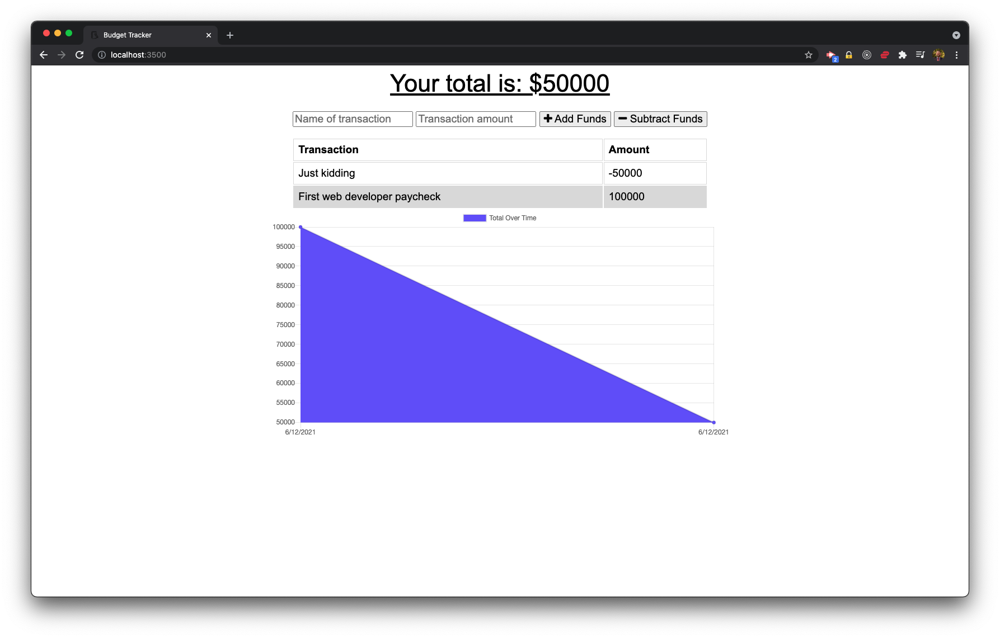
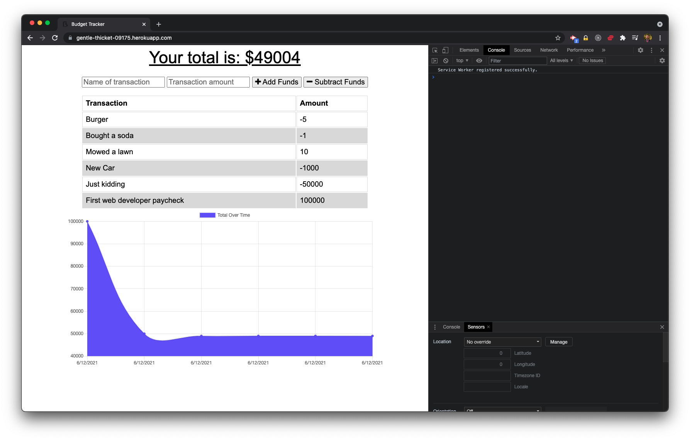

# Budget Tracker

## Description

Budget Tracker allows users to enter credits and debits and keeps track of the total amount in their budget. The app uses IndexedDB, a service-worker, and a web manifest to ensure users can continue to keep track of their money offline. The app is deployed on Heroku and MongoDB Atlas is used to store transactions.

## Deployed

See the deployed version of Budget Tracker [here](https://gentle-thicket-09175.herokuapp.com/).

## Table of Contents

- [Installation](#installation)
- [Usage](#usage)
- [Contribute](#contribute)
- [Test](#test)
- [License](#license)
- [Questions](#questions)

## Installation

Clone the GitHub repo, and set up a collection on MongoDB Atlas. Make sure to use a .env file to store your database credentials.

## Usage

To use the app, just enter a description for your transaction and the amount. Then decide if it's a credit or debit, and click the appropriate button. The amount will be entered into the database immediately if online. If you are offline, the API request will be stored in IndexedDB. When your network connection is restored, the app will automatically send the queued API requests to the database. The data will then persist within your app.

## Contribute

Feel free to email to offer any suggestions.

## Test

You can go to the deployed version [here](https://gentle-thicket-09175.herokuapp.com/) and try to add debits and credits. Check the console log to see that a Service Worker is being used. Turn the network connection off and on in the developer tools. You can add entries while offline, and the app will automatically send them to the database when the connection is restored.

## License

Copyright (c) Sam Gates. All rights reserved.
Licensed under the [MIT](https://opensource.org/licenses/MIT) license.

## Questions

Check out my [GitHub Profile](https://github.com/sg0703).

Email with questions! You can reach me at sam.j.gates@gmail.com.
